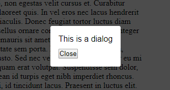

# dialog.js

A tiny javascript to simplify to use of `<dialog>` element.

**Be aware! Dialog has **



## In short

- Vanilla js
- No dependencies
- Small filesize
- Callback support
- Super simple setup
- Backdrop can be clicked to close

## Setup

### CSS

```html
<link rel="stylesheet" href="assets/css/dist/style.min.css">
```

### HTML

Add `data-dialog-open` to the element that should trigger the dialog. It should also contain the selector to the dialog, like `#my-dialog`.

The `data-dialog-close` to close the dialog works the same way.

```html
<dialog id="my-dialog">
  <div class="dialog-wrap">
    Some content
    <button data-dialog-close="#my-dialog">Close</button>
  </div>
</dialog>

<button data-dialog-open="#my-dialog">My trigger</button>
```

### Javascript

```html
<script src="assets/js/dist/script.min.js"></script>
<script>
let dialog = new Dialog();
dialog.init();
</script>
```

## Callbacks

Both `open` and `close` contains the same params which are `dialog` and `trigger` (elements).

```js
let dialog = new Dialog();
dialog.init({
  callbacks: {
    close: function(params){
      console.log(params);
    },
    open: function(params) {
      console.log(params);
    }
  }
});
```

## License

MIT

## Donate

Donate to [DevoneraAB](https://www.paypal.me/DevoneraAB) if you want.